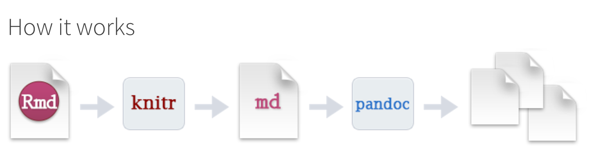

```{r setup, include=FALSE, cache=FALSE}
suppressPackageStartupMessages({
  library(knitr) 
  library(magrittr)
  library(dplyr)
  library(ggplot2)
  library(xtable)
  library(data.table)
  library(DT)
  library(shiny)
})
opts_chunk$set(echo = TRUE, cache = FALSE, comment="")
fit100 <- function(fname) sprintf('', fname)
fit50 <- function(fname) sprintf('', fname)
fig <- function(fname, size=100) 
  sprintf('', fname, size, size)
fig2 <- function(path, size = 100) {
  sprintf("</img>", path, size)
}
sys_name <- Sys.info()["sysname"] %>% tolower
sys_encode <- c("utf8", "utf8", "big5")[pmatch(sys_name, c("linux", "darwin", "windows"))]
sessionInfo() %>% capture.output %>% cat(file = "sessionInfo.log", sep = "\n")
thm <- theme(text=element_text(size=18))
las2 <- theme(axis.text.x = element_text(angle = 90, hjust = 1))
```

# Why we need R Markdown？


##  資料分析流程

<div style='float:right;width:58%;'>

</img>

</div>

> - 資料採集
> - 資料清洗處理
> - 統計及分析
> - 視覺呈現
> - <p style="color:#750000;font-size:36px;">報告產出</p>


## 資料分析 in R 

<center>
`r fig("ResearchPipeline.png", 84)`   
<small>https://www.coursera.org/course/repdata</small>
</center>

## Why we need R Markdown？
- 製作reproducible的報告、投影片
- 想寫數學式子好展現自己的專業 $e=mc^2$
- 只有一份source code，不需要額外複製圖片到報告中
- 需求更改時，可以動態改變報告內容
- 增加資料分析演算法的可讀性
- IDE? RStudio提供支援

## Why we need R Markdown？


> - 時間久了會忘記code的意思
> - 要寫說明文件給同學、同事、教授、主管
> - 教授很有想法，想嘗試新方法 <br> (~~FK！又要重跑一份~~)
> - 老闆說要改流程 <br> (~~MD!之前貼到簡報上的圖又要重貼一份~~)
> - **專案報告要呈現，code改了，但是文件無法同時修改！** <br> 

# Markdown

## What is Markdown？
- 啟發自2004年純文字電子郵件
- 好寫、好讀
- 可以純文字發布
- [Markdown](http://daringfireball.net/projects/markdown/basics)
    - Light weight markup language
    - Remove HTML tag for higher readibility.
    - Inline HTML is avaliable.
    - HTML5 Introduction ([w3schools.com](https://www.w3schools.com/html/html5_intro.asp))

## What is RMarkdown？
- 可以在 Markdown 內嵌 R code
- 一次呈現執行程式碼後的結果及文字說明
- 不用再把圖、表複製到其他文件編輯器中
- Rmd -> md -> html (docx, pdf)

<center>
</img>
</center>


## 前置作業 - 安裝
- 最新版的RStudio已經包含R Markdown功能
- 你也可以透過以下指令安裝R Markdown套件：

```{r eval=FALSE, echo=TRUE}
install.packages("rmarkdown")
```


# LiveDemo

## Source
- [An Introduction to R Markdown*](http://mansunkuo.github.io/rmd_tutorial/) by Mansun Kuo @ [DSC2014](http://taiwanrusergroup.github.io/DSC2014Tutorial/)
- [R Markdown Cheat Sheet](http://shiny.rstudio.com/articles/rm-cheatsheet.html)
- [R Markdown](http://rmarkdown.rstudio.com/)
- [knitr](http://yihui.name/knitr/)
- [RStudio Documentation](https://support.rstudio.com/hc/en-us/categories/200035113-Documentation)
- [Reproducible Research](https://www.coursera.org/course/repdata)
- [Shiny Articles](http://shiny.rstudio.com/articles/)
- [Publish to Github Pages/Dropbox/Rpubs](http://slidify.org/publish.html)

## Wush 教學影片

[Slidify簡介](https://www.youtube.com/watch?v=P97udK2ktuY) by Wush Wu  
https://www.youtube.com/watch?v=P97udK2ktuY  

[20121203 MLDM Monday:markdown + knitr (Hangout 轉播)](https://www.youtube.com/watch?v=OHKZLeKlUsM) by Wush Wu  
https://www.youtube.com/watch?v=OHKZLeKlUsM


## 繼續學習之路
- 了解自己的需求，詢問關鍵字與函數
- [Taiwan R User Group](http://www.meetup.com/Taiwan-R)，mailing list: Taiwan-useR-Group-list@meetup.com
- [ptt R_Language版](https://www.ptt.cc/bbs/R_Language/index.html)
- [R軟體使用者論壇](https://groups.google.com/forum/#!forum/taiwanruser)
- [StackOverflow](http://stackoverflow.com/) 
